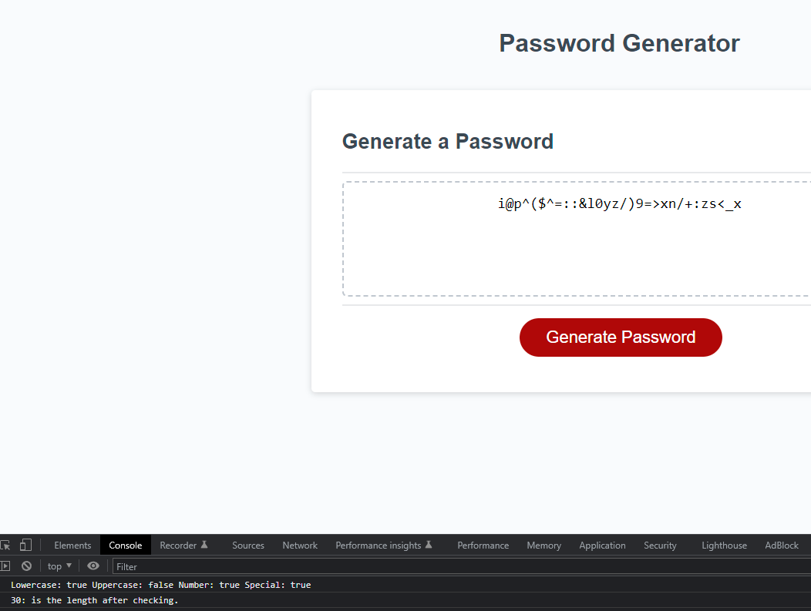

# Random Password Generator 
## Author: Francis Reyes- Module 3

## Description

This webpage was reformatted by the specifities included in the assignment to satisfy the User's acceptance criteria when it came to their web page. The code added included loops, if statements, and arrays to depict various elements generated in the system for a randomly generated password. By using the math functions to generate a random number along with generating a random character array filled with the user's specifications to output a custom password. Each time the button is pressed, a function to create a prompt on the screen begins. Then by selecting the buttons of Ok and Cancel, it proceeds through different prompts which sets certain values. Then the corresponding length and characters are included in the password to display it on the screen.

## Visuals

## Deployment

Provided as a link here - [Module 03](https://reyesfrancisp.github.io/random-password-generator-code/)

## Usage

To use the webpage, you can click the generate password button. Then you can proceed to select OK or cancel by clicking the button. When prompted for a number, you can enter values between 8 and 128 inclusive to proceed. Then the corresponding random password will be generated. You can click the generate password again to enter parameters so the program can generate a new password.

## Credits

- Bootcamp Tutor Team: for answering the questions and concerns I had regarding certain sections of my code and redoing it to make it appear how I wanted it to.

## License

Please refer to the LICENSE in the repo.
